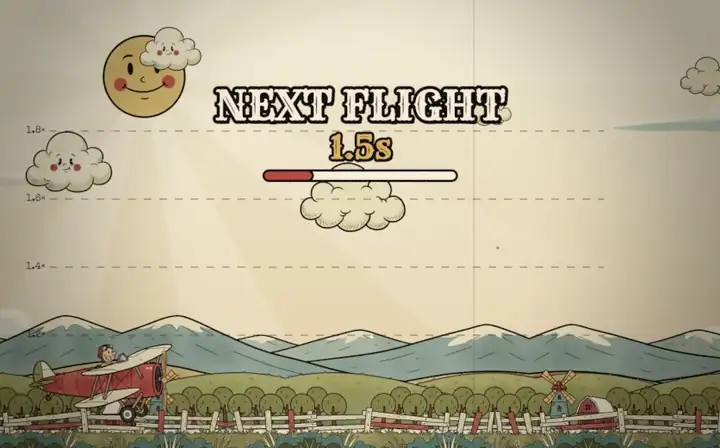
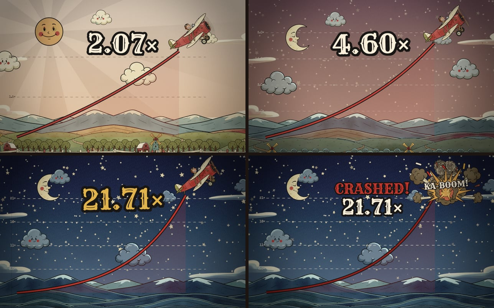
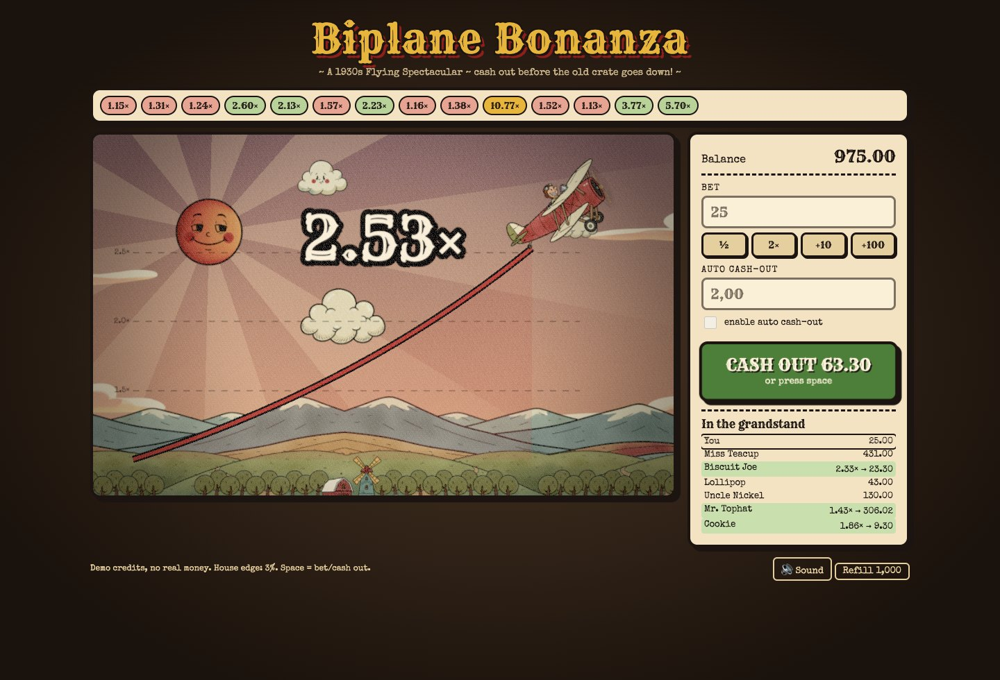
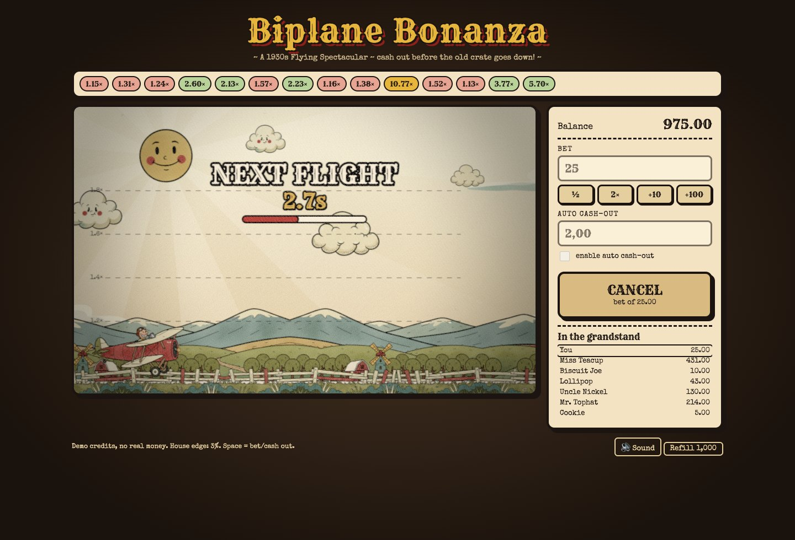
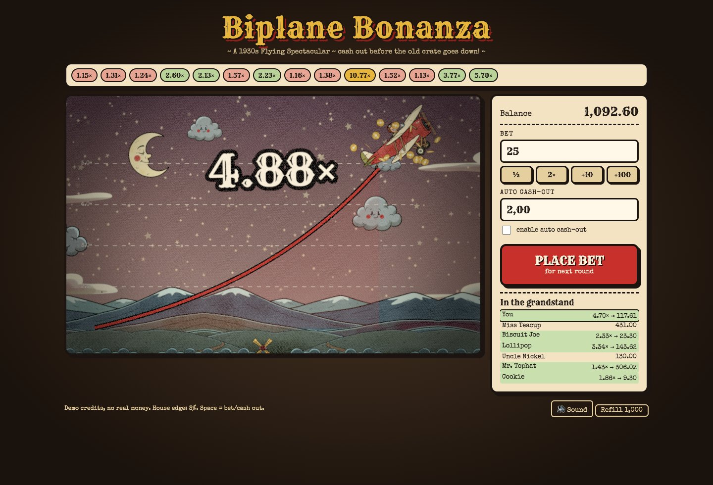
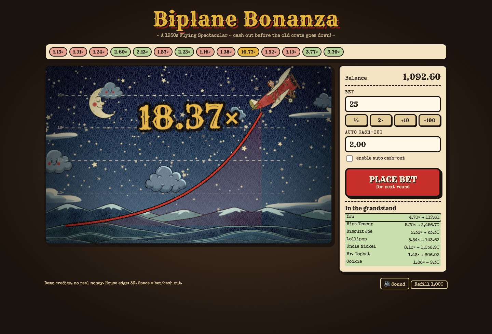
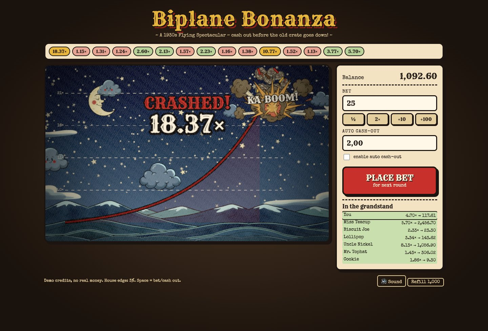
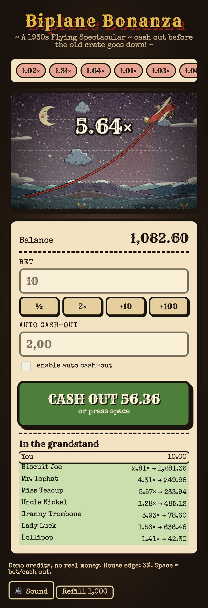
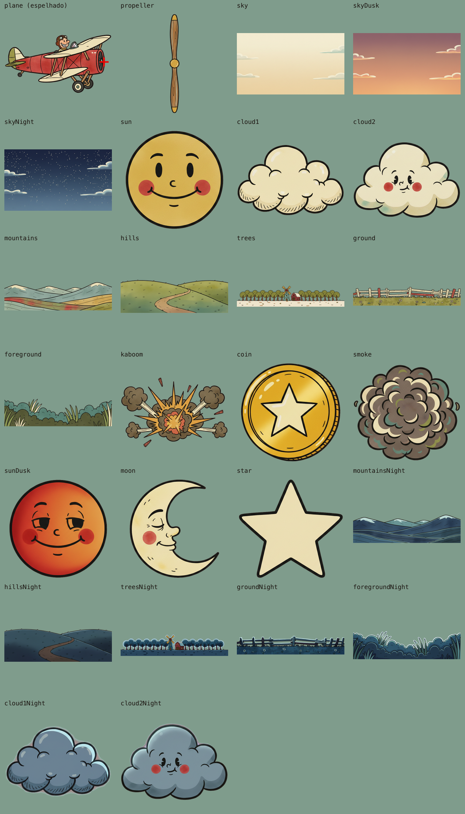
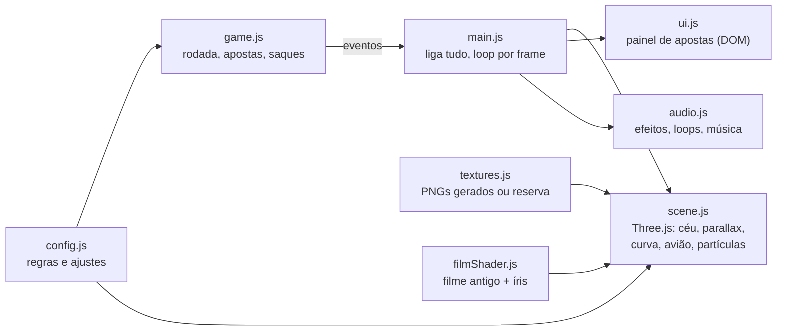

<div align="center">

# Biplane Bonanza

**Jogo de crash (iGaming) com cara de desenho animado dos anos 30.**<br>
Um biplano decola, o multiplicador sobe, o dia vira noite estrelada… saque antes que ele caia.



[](https://threejs.org)
[](https://vite.dev)
[](LICENSE)

</div>



> [!WARNING]
> **Protótipo com créditos de demonstração.** O resultado de cada rodada e o saldo são calculados no navegador. Antes de qualquer uso com dinheiro real, leia [Antes de usar com dinheiro real](#antes-de-usar-com-dinheiro-real).

## Sumário

- [O jogo](#o-jogo)
- [Rodando o projeto](#rodando-o-projeto)
- [Comandos](#comandos)
- [Arte gerada por IA](#arte-gerada-por-ia)
- [Som](#som)
- [Como o código é organizado](#como-o-código-é-organizado)
- [Ajustes rápidos](#ajustes-rápidos)
- [Antes de usar com dinheiro real](#antes-de-usar-com-dinheiro-real)
- [Créditos e licença](#créditos-e-licença)

## O jogo

Cada rodada tem três fases:

1. **Apostas (6 s).** Você aposta e, se quiser, liga o saque automático num multiplicador.
2. **Voo.** O biplano decola e o multiplicador cresce sem parar (`e^(0,085·t)`: 2× em ~8 s, 10× em ~27 s). Clique em **CASH OUT** (ou aperte **Espaço**) para sacar a aposta × multiplicador.
3. **Queda.** Num ponto sorteado o avião explode: KA-BOOM. Quem não sacou perde a aposta.

A margem da casa é de 3%: a chance de o voo passar de *x* é `0,97 / x` (até 1.000×). O histórico de rodadas fica no topo e a "arquibancada" mostra jogadores fictícios apostando junto.

**O que dá vida ao visual**

| | |
|---|---|
| **Parallax** | 5 camadas de cenário (montanhas, colinas, árvores, cerca, arbustos) em velocidades diferentes; o chão afunda conforme o avião sobe. |
| **Dia → noite** | O multiplicador guia a hora do dia: pôr do sol por volta de 2,5×, lua e estrelas a partir de ~4× e noite plena em 8×. O sol "vira" a lua, estrelas piscam e cenário/nuvens fazem cross-fade para versões noturnas desenhadas. |
| **Filme antigo** | Pós-processamento com granulado, vinheta, viragem sépia, riscos, poeira, tremidinha a 12 fps e transição de íris entre rodadas. |
| **Avião** | Hélice animada quadro a quadro (com disco de borrão em alta rotação), squash & stretch "rubber hose" e, na queda, a hélice sai voando. |
| **Som** | Ragtime e jazz dos anos 20/30, motor de biplano, projetor de filme, buzina "a-ú-ga", "ka-ching", fanfarra de circo, grilos e coruja à noite. |



<details>
<summary><b>Mais capturas (desktop e celular)</b></summary>

| Aposta feita, esperando a decolagem | Saque no pôr do sol |
|---|---|
|  |  |
| **Noite estrelada** | **A queda** |
|  |  |

<p align="center"><b>No celular</b><br></p>

As capturas são geradas por `npm run screenshots` (com o `npm run dev` rodando).

</details>

## Rodando o projeto

Precisa de **Node.js 20.19+ ou 22.12+** (exigência do Vite 8; desenvolvido com o 24).

```bash
npm install
npm run dev
```

Abra o endereço que o Vite mostrar (por padrão `http://localhost:5173`).

**No celular:** rode `npm run dev:mobile` e abra no celular o endereço "Network" (mesma rede Wi-Fi). O som destrava no primeiro toque e funciona mesmo com o iPhone no silencioso. Acrescente `?audiodebug` na URL para ver o estado do áudio no canto da tela (`running · 12/12 sons · música tocando` = tudo certo).

As artes e os sons já vêm prontos no repositório; os passos de [arte](#arte-gerada-por-ia) e [som](#som) abaixo só são necessários para gerar ou trocar algum.

## Comandos

| Comando | O que faz |
|---|---|
| `npm run dev` | Servidor de desenvolvimento |
| `npm run dev:mobile` | Mesmo servidor, aberto para a rede local (celular) |
| `npm run build` / `npm run preview` | Build de produção em `dist/` e prévia dele |
| `npm run assets` | Gera as artes que ainda não existem (OpenRouter, ver abaixo) |
| `npm run assets:all` | Gera o que faltar, na ordem certa: o avião primeiro e o resto com ele como referência de estilo |
| `npm run assets:plane-no-prop` | Apaga a hélice desenhada de um avião antigo (a hélice é animada à parte) |
| `npm run audio` | Trata os sons de `art/audio-src/` e gera `public/audio/` (precisa de `ffmpeg` e `ffprobe`) |
| `npm run screenshots` | Refaz as capturas deste README com um Chrome sem janela (rode junto com `npm run dev`) |

## Arte gerada por IA

Toda a arte vem do **Nano Banana** (`google/gemini-2.5-flash-image`) via **[OpenRouter](https://openrouter.ai)**, com o script [`scripts/generate-assets.mjs`](scripts/generate-assets.mjs).

```bash
cp .env.example .env        # coloque sua OPENROUTER_API_KEY
npm run assets:all          # gera o que faltar
```



**Como o pipeline funciona**

- **Fundo transparente:** o modelo não gera canal alfa, então o prompt pede fundo magenta chapado e o script remove a cor com `sharp` (flood fill a partir das bordas, vãos internos, bordas suavizadas e "desmistura" da cor), recorta e salva o PNG. Imagens com fundo errado são recusadas em vez de virar asset.
- **Originais guardados:** cada imagem crua fica em `art/raw/`, então dá para reprocessar sem pagar de novo (`--rekey`).
- **Consistência de estilo:** o avião é gerado primeiro e serve de referência (`--ref`) para os objetos; céu e cenário vão sem referência para o modelo não copiar o avião neles.
- **Variantes de noite:** `skyNight`, `mountainsNight` etc. repintam a imagem do dia (mesma composição, outra luz), o que permite cross-fade perfeito no jogo. Se a imagem do dia mudar, o script avisa que a variante ficou desatualizada.
- **Hélice:** o avião é gerado sem hélice; a hélice vem à parte e o script cria 8 quadros de giro e detecta onde fica o nariz (o "+" vermelho na prévia).
- **Prévia:** `art/preview.png` mostra todos os assets sobre fundo liso para conferir recortes.
- **Custo:** o script mostra o custo de cada imagem informado pelo OpenRouter.

<details>
<summary><b>Opções do gerador</b></summary>

```bash
npm run assets -- plane sun           # só os assets citados
npm run assets -- --force             # regera (sobrescreve)
npm run assets -- --skip plane        # tudo menos os citados
npm run assets -- --ref art/raw/plane.png
npm run assets -- --rekey             # refaz a remoção de fundo a partir de art/raw (sem custo)
npm run assets -- plane --rekey --flop    # espelha (ex.: avião veio virado para a esquerda)
npm run assets -- plane --edit "..."  # edita a imagem existente com o modelo
npm run assets -- --dry-run           # mostra os prompts sem chamar a API
```

Os prompts descrevem o estilo "rubber hose dos anos 30" sem citar personagens ou jogos existentes. Se um asset não existir, o jogo usa uma versão desenhada em código (o céu vira um gradiente), então roda mesmo sem arte gerada. As exceções são `sunDusk` e as variantes `*Night` do cenário e das nuvens: sem elas, o sol, o cenário e as nuvens continuam com a imagem do dia durante a noite.

</details>

## Som

Sons e músicas do **[Pixabay](https://pixabay.com)** (Pixabay Content License: uso comercial, crédito não obrigatório). Lista completa com autores e links em [`art/audio-src/SOURCES.md`](art/audio-src/SOURCES.md).

| Momento | Som |
|---|---|
| Espera / dia | Playlist "Silent Movie" (charleston em disco antigo) + "Silent Movie" (ragtime ao piano), com cross-fade |
| Noite | "Night Jazz", entrando aos poucos com o céu escurecendo, + grilos e uma coruja |
| Fundo | Projetor de filme rodando, bem baixo |
| Contagem / botões | Bloco de madeira / tecla de máquina de escrever |
| Decolagem / voo | Buzina "a-ú-ga" / motor de biplano (o tom sobe com o multiplicador) |
| Aposta / saque | Moeda / caixa registradora "ka-ching" (+ fanfarra de circo a partir de 5×) |
| Queda | Explosão de desenho + apito descendo |

Para **trocar** um som: substitua em `art/audio-src/` o arquivo indicado no campo `src` da tabela `SOUNDS` de [`scripts/process-audio.mjs`](scripts/process-audio.mjs) (ou aponte o `src` para o novo arquivo) e rode `npm run audio` (ou `npm run audio -- engine` para tratar só um, pelo campo `name`). Para um som **novo**, acrescente uma entrada em `SOUNDS` e toque-o em [`src/audio.js`](src/audio.js); só colocar o arquivo na pasta não basta.

O script corta silêncios, normaliza o volume, monta loops sem emenda e grava o volume real no manifest (o jogo compensa o que o limitador tirar). O mix fica em `MIX`, em [`src/audio.js`](src/audio.js).

No celular, o áudio é feito para não dar problema: os sons já baixam e decodificam enquanto o jogo carrega, destrava no primeiro toque em qualquer lugar (até na tela de carregamento) e sai nesse mesmo toque, toca no modo silencioso do iPhone, devolve o áudio do aparelho quando o jogo está no mudo (sua música de outro app volta a tocar), descarta sons enquanto o sistema interrompe o áudio (em vez de tocar tudo junto depois) e toca as músicas em streaming para economizar memória.

> [!NOTE]
> As músicas estão registradas no Content ID do YouTube. Isso não afeta o jogo, mas trailers e gameplays postados lá podem receber reivindicação automática (contestável com a licença do Pixabay).

## Como o código é organizado



```
├── index.html, src/
│   ├── main.js          liga jogo, cena, painel e som
│   ├── game.js          máquina de estados da rodada (espera → voo → queda)
│   ├── scene.js         mundo Three.js (câmera ortográfica, camadas, curva, avião, ciclo dia/noite)
│   ├── filmShader.js    pós-processamento de filme antigo
│   ├── textures.js      carrega public/assets (+ versões procedurais de reserva)
│   ├── draw.js          utilitários de canvas (letreiro com contorno, starburst)
│   ├── audio.js         som (Web Audio + streaming de música)
│   ├── ui.js, style.css painel de apostas
│   └── config.js        números do jogo e do visual
├── public/
│   ├── assets/          PNGs do jogo + manifest.json   (gerados)
│   └── audio/           MP3s do jogo + manifest.json   (gerados)
├── art/
│   ├── raw/             imagens cruas do modelo (para --rekey)
│   ├── audio-src/       sons originais do Pixabay + SOURCES.md
│   └── preview.png      folha de prévia das artes
├── scripts/
│   ├── generate-assets.mjs   arte com OpenRouter + Nano Banana
│   ├── process-audio.mjs     tratamento de áudio com ffmpeg
│   └── capture-screenshots.mjs   capturas do README (Chrome sem janela)
└── docs/screenshots/    imagens deste README
```

## Ajustes rápidos

Quase tudo que se quer mexer está em [`src/config.js`](src/config.js):

| Bloco | Exemplos |
|---|---|
| `CONFIG` | margem da casa, velocidade do multiplicador, duração das fases, saldo inicial (os textos "House edge: 3%" e "Refill 1,000" do rodapé ficam fixos em [`index.html`](index.html): atualize junto) |
| `PARALLAX`, `CLOUDS` | altura, velocidade e profundidade de cada camada de cenário |
| `PLANE` | tamanho do avião, posição/velocidade da hélice, borrão |
| `DAY_CYCLE` | em que multiplicador começa o pôr do sol e a noite, número de estrelas |

Em desenvolvimento, `window.__bb` expõe `game`, `world`, `textures`, `sfx` e `hud` no console para inspeção.

## Antes de usar com dinheiro real

Este repositório é um **protótipo de jogo e de visual**. Para operar como produto de apostas:

- **Servidor autoritativo:** o resultado da rodada, o saldo e os saques precisam ser decididos no servidor. Hoje o ponto de queda é sorteado no navegador (`crypto.getRandomValues`) e o saldo fica no `localStorage`.
- **Provably fair:** resultados de uma cadeia de seeds com hash publicado antes das rodadas, para o jogador conferir depois.
- **Carteira, KYC e jogo responsável:** integração com pagamentos, verificação de identidade, limites e autoexclusão.
- **Licença de operação** no país onde o jogo vai rodar (no Brasil, a regulamentação de apostas de quota fixa da Lei 14.790/2023 e as portarias da Secretaria de Prêmios e Apostas). A licença do Pixabay também proíbe uso ilegal do conteúdo.

## Créditos e licença

- **Código:** [MIT](LICENSE), © 2026 Alexandre Junior.
- **Arte:** gerada para este projeto com Gemini 2.5 Flash Image (via OpenRouter), estilo inspirado nos desenhos animados dos anos 30.
- **Sons e músicas:** Pixabay — autores em [`art/audio-src/SOURCES.md`](art/audio-src/SOURCES.md).
- **Fontes:** [Rye](https://fonts.google.com/specimen/Rye) (SIL Open Font License) e [Special Elite](https://fonts.google.com/specimen/Special+Elite) (Apache 2.0), via Google Fonts.
- **Bibliotecas:** [Three.js](https://threejs.org), [Vite](https://vite.dev), [sharp](https://sharp.pixelplumbing.com), [ffmpeg](https://ffmpeg.org).
